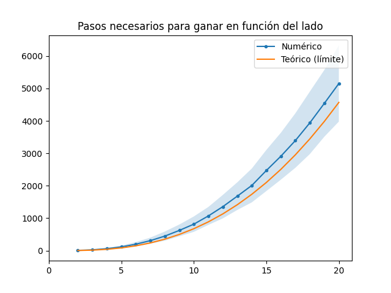

# ¿Cuánto tarda un borracho en ganar al Pacman?

En esta serie de artículos vamos a estudiar un aspecto de los más dinámicos de la inteligencia artificial: el desarrollo de robots.
No tanto como Skynet (todavía), pero sí que pueda realizar alguna tarea como un humano: jugar al Pacman.
Para eso necesitamos *armar un Pacman*; vamos a hacer un Pacman más sencillo, en el que no hay fantasmas.

Aprovechemos que no hay fantasmas para hacer jugar a un tipo de jugador que probablemente sobreviviría poco: un borracho jugando al Pacman.
El borracho jugando al pacman juega completamente *al azar*.
En cada momento elige de forma aleatoria para dónde va en el siguiente paso: para arriba, para abajo, para la izquierda o para la derecha.

Les pregunto entonces: en el nivel inicial (que estes que copiamos aquí) y sabiendo que el pacman se desplaza a una velocidad aproximada de 10 casilleros por segundo, **¿cuánto tiempo dicen que tardaría un borracho en comerse todas las bolitas?**


En la sección que sigue vamos a describir un poco cómo fue el diseño y la implementación del Pacman en Python.
Si no les interesa tanto esto, pueden saltearla e ir directamente a la sección resultados.

## El Pacman

Vamos a describir el estado del juego Pacman en la clase `Estado`.
Esta clase va a tener (por ahora) los siguientes atributos:

- `mapa`: un array bidimensional que tiene `1` cuando hay una bolita, `0` cuando está vacío y `-1` cuando el lugar está prohibido.
- `posicion`: la posición en la que se encuentra el Pacman
- `puntaje`: cuántas bolitas comió
- `cantidad_pasos`: cuántos pasos hizo

Quiero aclarar aquí que hay una decisión bastante discutible en cuanto a diseño: que la posición del Pacman forme parte del `Estado`.
Quizás (seguramente, incluso) sea mejor pensar tres clases: `Pacman`, `Mapa`, `Fantasma` y que el estado del juego sea una composición de las tres (ya sea en una clase o no).
Esta estrategia de diseño la vamos a usar más adelante, pero por ahora (para nuestro objetivo), con esto es necesario.
Cuando queramos seguir (no voy a poner más spoilers) vamos a ver cómo adaptamos esta funcionalidad a un diseño un poco más sofisticado.

Por ahora, este `Estado` se encarga *de todo*.
Afortunadamente, igual, *todo* es bastante poco en este caso: sería avanzar una posición y saber si se terminó el mapa:
    
### Avanzar una posición

```python
def avanzar_posicion(self, accion: np.ndarray):
    nueva_posicion = self.posicion + accion
    if nueva_posicion[0] == np.shape(self.mapa)[0]:
        nueva_posicion[0] = 0
    elif nueva_posicion[0] == -1:
       nueva_posicion[0] = np.shape(self.mapa)[0] - 1
    if nueva_posicion[1] == np.shape(self.mapa)[1]:
        nueva_posicion[1] = 0
    elif nueva_posicion[1] == -1:
        nueva_posicion[1] = np.shape(self.mapa)[1] - 1
    self.cantidad_pasos += 1
    if self.mapa[tuple(nueva_posicion)] != -1:
        self.puntaje += self.mapa[tuple(nueva_posicion)]
        self.posicion = nueva_posicion
        self.mapa[tuple(nueva_posicion)] = 0
```

`avanzar_posicion` toma `accion`, un array de dos posiciones: cuánto se mueve en las filas y en las columnas (`+1`, `0`, `-1`), de modo que quedan codificados los movimientos:
- `[1, 0] = ↓`: sumar una fila es análogo a ir para abajo
- `[-1, 0] = ↑`: restar una fila es análogo a ir para arriba
- `[0, 1] = →`: sumar una columna es análogo a ir para la derecha
- `[0, -1] = ←`: restar una columna es análogo a ir para la izquierda

Avanzar posición es bastante fácil, es cuestión de `posicion_nueva = posicion_actual + accion`.
Luego de eso hay un par de cosas extra:

1. Si el Pacman "se cae del mapa", aparece del otro lado: eso son las siguientes 8 líneas.
2. El mapa se actualiza sólo si la nueva posición no está prohibida.
3. Cuando se mueve, al puntaje le sumamos lo que estaba en esa posición (1 si había una bolita, que se comió), y pasamos esa posición a 0.

### Terminó el mapa

```python
@property
def completo(self):
    return not (self.mapa == 1).any()
```

Éste lo agregamos únicamente porque tiene el decorador `property`, que quizás no lo conozcan todos.
Podríamos tener pronto un lindo artículo sobre decoradores en Python, pero brevemente: `@property` permite que el método sea llamado como un atributo.
Es decir, que el mapa esté `completo` o no lo sabemos sólo haciendo una cuenta, no podemos configurarlo fácilmente como un atributo sin más.
Más aún, uno no debería poder modificar el `completo` desde afuera de la clase `Estado`.
En muchos lenguajes esto se resuelve con lo que se llaman `getter/setter`: en vez de que exista el atributo `completo` existe el método `get_completo()`, que hace la cuenta necesaria.
En Python, eso se resuelve de una forma súper limpia con los `@property`.
### Bonus: `__str__`

Tenemos que imprimir el estado del juego de alguna manera.
Una posibilidad es hacer una función que toma el estado y genera un `string`, pero Python viene preparado para eso.
Cuando escribimos `print`, llamamos (básicamente) al método `__str__` de la clase.
Es decir, si modificamos `__str__`, podemos hacer que `print(estado)` imprima en pantalla directamente el mapa como queremos.
Quizás podemos hacer más adelante una nota de `__str__`, `__repr__` y similares, pero por ahora vamos a centrarnos en esta implementación.
Queremos que el dibujo primero diga cómo va el juego (puntaje y cantidad de pasos) y luego dibuje un cuadrado lleno cuando hay una pared (o sea, está prohibido), un espacio vacío cuando no hay nada y un puntito cuando hay una bolita.
Además, al pacman lo vamos a simbolizar con una O.
Así, queda

```python
def __str__(self):
    dibujo = f'puntos: {self.puntaje}, pasos: {self.cantidad_pasos}\n'
    for i, row in enumerate(self.mapa):
        for j, val in enumerate(row):
            if (np.array([i, j]) != self.posicion).any():
                if val == 1:
                    dibujo = dibujo + '·'
                elif val == 0:
                    dibujo = dibujo + ' '
                else:
                    dibujo = dibujo + '█'
            else:
                dibujo = dibujo + 'O'
        dibujo = dibujo + '\n'
    return dibujo
```

y esto va a salir cada vez que hagamos `print(estado)`.

## Resultados

¿Cómo se "juega" a este pacman entonces?
Creamos un `estado` a partir de un `mapa` y, mientras no esté completo, elegimos una acción al azar y avanzamos el estado:
```python
estado = Estado(mapa)
while not estado.completo:
    accion = random.choice(acciones)
    estado.avanzar_posicion(accion)
print(f"Terminé en {estado.cantidad_pasos} pasos")
```

Este código lo ejecutamos (agregándole algún que otro `print` y `sleep` para que se pueda ver) y tenemos un `Pacman` que se mueve al azar en un `mapa`.
Como ejemplo, aquí va el resultado cuando el `mapa` es un mapa de `5x5` sin paredes:


En este ejemplo el borracho tardó <> pasos en completar el juego, que a 10 bolitas por segundo es lo mismo que tardar <> segundos.
Obvio que éste fue un caso en particular, y tiene ese `random` por ahí.
¿Qué pasa si lo ejecutamos muchas veces?
¿Cuánto da en promedio la cantidad de pasos?
A continuación va el histograma con 10 mil iteraciones.


En este histograma el promedio es 117.28 pasos (y la desviación estándar 41.67): aproximadamente 12s en resolver el mapa por completo.

Antes de responder la pregunta del borracho jugando al Pacman, perdón si me voy un poco por las ramas, pero me surgió la pregunta: ¿cómo depende la cantidad de pasos del tamaño del mapa?

### Dependencia con el tamaño

Estaba relativamente fácil: poner el código anterior en un loop que vaya haciendo el barrido para los distintos lados y guardar pasos promedio y desviación estándar.
Resulta (de esto me enteré gracias a Patu Groisman, síganlo en [twitter](twitter.com/pgroisma) que es un capo) que este resultado fue encontrado teóricamente hace muuuy poco, y para tamaños muy grandes de mapa tiende a la forma `4 * (n log n)^2/pi`.

Así sale este gráfico:



Fíjense que hay una diferencia considerable, pero se va a ir achicando a medida que agrandemos `n`.[^1]

### Ahora sí, ¿cuánto tarda el borracho?

Con todo lo que hicimos, lo que queda es armar el mapa, que se ve así (un poquito más feo que el original, no?)


Y el histograma de pasos queda


En promedio son 6999.2 pasos, con desviación estándar 2657.
Con los tiempos que dijimos, de 10 pasos por segundo, a un borracho le llevaría ¡11 minutos! ganar al Pacman si no hubiera fantasmas.

Todo este código está subido en un repo particular, que pueden chusmear, clonar, forkear y otros neologismos: https://www.github.com/ninja-ia/pacman

## Y ahora, ¿qué?

Podríamos quedarnos aquí, sí... pero nos gusta el Pacman y esto es un blog de Inteligencia Artificial.
Dejamos para la próxima edición la pregunta: ¿cómo le enseñamos al borracho a jugar al Pacman? ¿Y a los fantasmitas?
Nos vemos la próxima!

[1]: Con este modelo, es demasiado costoso hacer las cuentas para `n` grandes, pero quizás luego completaremos este resultado con tamaños más grandes
