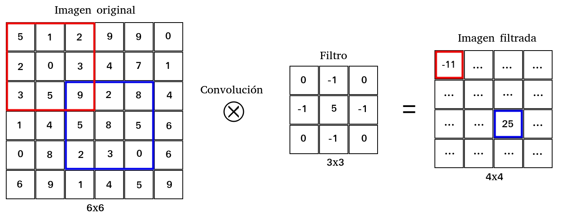

# Detección en YOLO, frame por frame


La visión por computadora es una de las áreas del aprendizaje automático con mayor cantidad de avances en los últimos tiempos y, sin embargo, donde también quedan aún muchos problemas por resolver. Dentro de este campo podemos pensar en varias subdivisiones según la tarea realizar, por ejemplo, clasificación de imágenes, detección de objetos, procesamiento de imágenes y un largo etcétera. En este artículo vamos a trabajar en el problema de la detección de múltiples objetos en imágenes utilizando YOLO+Darknet, una de las combinaciones más potentes para tal tarea. 

YOLO (You Only Look Once) es una arquitectura de red convolucional propuesta originalmente por Joseph Redmon, Santosh Divvala, Ross Girshick y Ali Farhadi [https://arxiv.org/abs/1506.02640]. Con el paso del tiempo se han realizado diversas mejoras a la arquitectura original y al día de hoy se encuentra disponible YOLOv4, su última versión. Aunque es posible implementar la arquitectura de YOLO en diversas plataformas, quizás la más conveniente para tal fin es la que brinda Darknet. 
Darknet es un framework pensado para implementar distintas arquitecturas de redes buscando la mayor eficiencia de cómputo. La contrapartida que tiene es una mayor dificultad de implementación comparado con otros frameworks más conocidos como TensorFlow o Pytorch.

En este artículo no pretendemos explicar la arquitectura ni el funcionamiento de YOLO. Lo que haremos, en cambio, es mostrar cómo utilizar la implentación de Darknet y cuáles son las primeras dificultades que pueden aparecer cuando intentamos hacer esto utilizando Python. Primero, sin embargo, vamos a mencionar muy brevemente el principio de funcionamiento de una red convolucional para ubicar en contexto el problema que estamos intentando resolver.

Si pensamos en una imagen representada por una matriz, donde cada píxel es un valor numérico, podemos pensar también en que alguna transformación sobre esta imagen no es otra cosa que una transformación sobre la matriz original. En particular se suele pensar en las imágenes como la composición de 3 matrices, una por cada color RGB. Dentro del campo del procesado de imágenes una transformación comúnmente utilizada es la convolución. Convolucionar una imagen (matriz) con un filtro (matriz) da como resultado una nueva imagen más pequeña que la original. Esta imagen tendrá una u otra característica según el filtro que se haya utilizado a la hora de convolucionar. Algunos filtros muy comunes son aquellos que buscan bordes en la imagen (edge), aquellos que la difuminan (blur), etcétera. Estos filtros sirven para, en definitva, extraer o resaltar alguna propiedad (feature) de la imagen original. Estas propiedades filtradas pueden aportar información relevante sobre la imagen original y esta puede ayudar en un proceso de clasificación, de identificación de objetos o de cualquier otra tarea que uno pueda pedirle a una red neuronal.



La pregunta entonces es cómo pasarle esta información adicional (filtrada de la imagen original) a una red neuronal. La respuesta a este problema viene dado por las redes convolucionales. En ellas uno pasa solo la imagen original como input. Luego, en las capas convolucionales, cada neurona (convolucional) aplica un filtro a la imagen que llega de la capa anterior y entrega como resultado una nueva imagen filtrada. Y entonces, ¿qué filtro aplican estas capas convolucionales?. La respuesta es ninguno en especial. Las redes convolucionales heredan la filosofía de las redes multiperceptrón donde cada neurona entrena sus pesos y por lo tanto la operación que esta realiza sobre la entrada. En las neuronas convolucionales lo que se entrena es el filtro aplicado a la entrada. Además, uno puede incluir muchas capas convolucionales, con lo cual, cada capa aplica una serie de filtros sobre las imágenes provenientes de las capas anteriores. Esto permite "apilar" una sucesión de filtros donde cada uno recoge alguna característica distinta de la imagen. Esta lógica permite una inmensa flexibilidad y un potencial enorme a la hora de extraer información sobre una imagen original. Finalmente, al final de las capas convolucionales se suele agregar alguna capa multiperceptrón para que esta actúe como clasificador, regresor, etcétera.

Bajo esta lógica es que funcionan las redes convolucionales y en particular la arquitectura de YOLO. Teniendo esto presente es que vamos a utilizar el framework de Darknet [https://pjreddie.com/darknet/] para implementar YOLO y mostraremos los primeros problemas a los que uno se enfrenta cuando decide utilzar Python para tal fin. Utilizaremos para la tarea YOLOv3.

Veamos...

Siguiendo la guía de instalación de Darknet de su página oficial, encontramos una explicación de cómo realizar una detección usando el ejecutable generado después de compilar. Sin embargo, es también posible hacer lo mismo utilizando el archivo `darknet.py` que ya viene en el paquete. Este código de Python tiene un conjunto de funciones que nos permiten realizar una detección sobre la imagen seleccionada, con el simple requerimiento de que especifiquemos la dirección de la carpeta contenedora de la imagen. Esto se consigue en la línea
```python
  r = detect(net, meta, b"/direction/image.jpg")
```
que está dentro de la función `main` al final del archivo. El resultado de la detección se entrega cuando corremos el archivo `darknet.py` en la consola.

Tengan en mente que este archivo está escrito para Python 2, que ya está deprecado dado que ahora existe Python 3, el cual recomendamos usar. Es necesario entonces implementar unos cambios en el archivo antes que nada:

- Todas las direcciones de los archivos deben llevar una `b` delante de las comillas de la dirección. Esto se debe a un cambio de formato en los archivos. El formato no es un `string`, sino del tipo `bytes`, y en Python 3 esto debe ser especificado.
- Las direcciones en `net` y `meta` (la red, los pesos y los nombres) deben ser cambiados, y también la dirección del archivo `libdarknet.so` en la línea `lib`.
- Además, existe ahora `yolov3` así que es posible descargarlo y usar los nuevos pesos y la red.
- Cuidado con la dirección del archivo `coco.names` que se especifica dentro de `coco.data` en la carpeta `cfg/`, es necesario añadirle la dirección completa.
- No se olviden de añadir los paréntesis correspondientes en las líneas de `print` (esto es necesario en Python 3).

Ahora vamos al grano, el interés de esta publicación es realizar la detección de un video frame por frame. La función `VideoCapture` del paquete `cv2` procesa el video y es posible leer y guardar cada frame usando `read()`. Pero el archivo `darknet.py` no entiende el formato de `frame`; necesita una imagen. Para poder correr la red en un video es necesario convertir los frames a formato imagen, y para lograrlo escribimos una función que explicamos más abajo.


##Nuestra función


Utilizaremos la función de detección en `darknet.py`, así que es menester alimentarla con algo que pueda digerir. Así es que necesitamos saber qué es. Notamos que `detect` carga la imagen utilizando la función `load_image`, una función de C que `darknet.py` traduce a Python. Buscándola, descubrimos que está escrita en el archivo `image.c` dentro del directorio `src/`, y que llama a la función `load_image_stb` escrita algunas líneas arriba en el mismo archivo. La salida de esta función es la entrada de `detect` con lo cual nos dice cuál es el formato deseado para el frame. En este caso es la clase `darknet.IMAGE`, definida por

```python
class IMAGE(Structure):
	_fields_ = [("w", c_int),
            	("h", c_int),
            	("c", c_int),
            	("data", POINTER(c_float))]
```

Recuerden que una imagen tiene una altura `h`, un ancho `w`, `h*w` píxeles y tres colores por cada píxel: un triplete `[x,y,z]`, donde cada uno va desde cero a uno. Entonces tenemos `h*w*3` números para definirla. Un frame es un de la clase `numpy.ndarray`. Necesitamos tener una clase `darknet.IMAGE` para que la función `detect` pueda leerla.

Pero lo que tenemos a partir de la lectura de `cv2` son frames. Un frame es un `array` con tres coordenadas donde las dos primeras refieren a la posición, con coordenadas `h` y `w` y la tercera al vector de colores. Podemos pictorizarlo como

```
   [ [[x1 y1 z1], [x2 y2 z2],... [xn yn zn]], [[xn+1 yn+1 zn+1],... ], ... [ ] ]
```

y estos números corren de cero a 255: son coordenadas RGB.

En principio, podemos usar este array como la cuarta entrada de la función `IMAGE`, pero esto no funcionará. Por qué y cómo resolverlo puede ser encontrado en la función `load_image_stb`, previamente mencionada,

```c
image load_image_stb(char *filename, int channels)
```

En particular, hay una parte del código donde podemos ver cómo es el formato de salida,

```c
for(k = 0; k < c; ++k){
    	for(j = 0; j < h; ++j){
        	for(i = 0; i < w; ++i){
            	int dst_index = i + w*j + w*h*k;
            	int src_index = k + c*i + c*w*j;
            	im.data[dst_index] = (float)data[src_index]/255.;
        	}
    	}
	}
```

Esto define el correcto ordenamiento del vector. Siguiendo la notación de arriba, donde `(xi,yi,zi)` es el triplete de la coordenada i, el vector de entrada de `IMAGE` debe tener la pinta

```
[z1, z2, z3, ..., y1, y2, y3, ..., x1, x2, x3, ...]
```

Ahora que conocemos el ordenamiento, podemos escribir nuestra propia función que convierta frames en imágenes de la clase IMAGE con el orden específico. La función queda

```python
def frameToImage(frame):
  frame = (frame/255).astype(ct.c_float)
  me = np.hstack((frame[:, :, 2].flatten(), frame[:, :, 1].flatten(), frame[:, :, 0].flatten()))
  img = dn.IMAGE(frame.shape[1], frame.shape[0], 3, me.ctypes.data_as(ct.POINTER(ct.c_float)))
  return img
```

Necesitamos importar el paquete `ctypes`, que nos permite manipular tipos de C en Python. En la primera línea de la función, normalizamos cada elemento del frame de forma tal de que vaya de cero a uno y lo convertimos en un flotante de C. A continuación, queremos que todos los elementos estén en un a sola fila, así que tomamos todos los elementos de un color (por ejemplo, `frame[:,:,2]`), lo ponemos en una lista y removemos los paréntesis con `flatten`. Usando `hstack` creamos un vector que contiene todos los elementos en una misma fila, como queríamos. Queda algo como esto

```
 [z1 z2 z3 ... y1 y2 y3... x1 x2 x3...]
```
que es exactamente lo que necesitamos como entrada para `IMAGE`.

Finalmente, en la última línea, creamos una image class, así que le entregamos el ancho, la altura, un 3 que corresponde a la cantidad de colores y el vector que creamos antes, convertido en un puntero a flotante de C.

¡Al fin! Lo único que nos queda es reemplazar algunas pocas líneas en la función detect para cargar la imagen y estamos listos. Modificamos el archivo `darknet.py`, a partir de ahora contendrá nuestra función `frameToImage` y `detect` tomará un frame, llamará a nuestra función y la transformará en una clase de imagen por su propia cuenta. No tendrá salida ya que la usamos como una librería. Abajo escribimos el código

```python
from ctypes import *
import ctypes as ct
import math
import random
import cv2
import numpy as np

def sample(probs):
    s = sum(probs)
    probs = [a/s for a in probs]
    r = random.uniform(0, 1)
    for i in range(len(probs)):
        r = r - probs[i]
        if r <= 0:
            return i
    return len(probs)-1

def c_array(ctype, values):
    arr = (ctype*len(values))()
    arr[:] = values
    return arr

class BOX(Structure):
    _fields_ = [("x", c_float),
                ("y", c_float),
                ("w", c_float),
                ("h", c_float)]

class DETECTION(Structure):
    _fields_ = [("bbox", BOX),
                ("classes", c_int),
                ("prob", POINTER(c_float)),
                ("mask", POINTER(c_float)),
                ("objectness", c_float),
                ("sort_class", c_int)]


class IMAGE(Structure):
    _fields_ = [("w", c_int),
                ("h", c_int),
                ("c", c_int),
                ("data", POINTER(c_float))]

class METADATA(Structure):
    _fields_ = [("classes", c_int),
                ("names", POINTER(c_char_p))]

    

lib = CDLL("/home/user/darknet/libdarknet.so", RTLD_GLOBAL)
lib.network_width.argtypes = [c_void_p]
lib.network_width.restype = c_int
lib.network_height.argtypes = [c_void_p]
lib.network_height.restype = c_int

predict = lib.network_predict
predict.argtypes = [c_void_p, POINTER(c_float)]
predict.restype = POINTER(c_float)

set_gpu = lib.cuda_set_device
set_gpu.argtypes = [c_int]

make_image = lib.make_image
make_image.argtypes = [c_int, c_int, c_int]
make_image.restype = IMAGE

get_network_boxes = lib.get_network_boxes
get_network_boxes.argtypes = [c_void_p, c_int, c_int, c_float, c_float, POINTER(c_int), c_int, POINTER(c_int)]
get_network_boxes.restype = POINTER(DETECTION)

make_network_boxes = lib.make_network_boxes
make_network_boxes.argtypes = [c_void_p]
make_network_boxes.restype = POINTER(DETECTION)

free_detections = lib.free_detections
free_detections.argtypes = [POINTER(DETECTION), c_int]

free_ptrs = lib.free_ptrs
free_ptrs.argtypes = [POINTER(c_void_p), c_int]

network_predict = lib.network_predict
network_predict.argtypes = [c_void_p, POINTER(c_float)]

reset_rnn = lib.reset_rnn
reset_rnn.argtypes = [c_void_p]

load_net = lib.load_network
load_net.argtypes = [c_char_p, c_char_p, c_int]
load_net.restype = c_void_p

do_nms_obj = lib.do_nms_obj
do_nms_obj.argtypes = [POINTER(DETECTION), c_int, c_int, c_float]

do_nms_sort = lib.do_nms_sort
do_nms_sort.argtypes = [POINTER(DETECTION), c_int, c_int, c_float]

free_image = lib.free_image
free_image.argtypes = [IMAGE]

letterbox_image = lib.letterbox_image
letterbox_image.argtypes = [IMAGE, c_int, c_int]
letterbox_image.restype = IMAGE

load_meta = lib.get_metadata
lib.get_metadata.argtypes = [c_char_p]
lib.get_metadata.restype = METADATA

load_image = lib.load_image_color
load_image.argtypes = [c_char_p, c_int, c_int]
load_image.restype = IMAGE

rgbgr_image = lib.rgbgr_image
rgbgr_image.argtypes = [IMAGE]

predict_image = lib.network_predict_image
predict_image.argtypes = [c_void_p, IMAGE]
predict_image.restype = POINTER(c_float)

###void draw_detections(image im, detection *dets, int num, float thresh, char **names, image **alphabet, int classes)   
draw_detections = lib.draw_detections
draw_detections.argtypes = [IMAGE, POINTER(DETECTION),c_int, c_float,c_void_p, c_void_p,c_int]


def classify(net, meta, im):
    out = predict_image(net, im)
    res = []
    for i in range(meta.classes):
        res.append((meta.names[i], out[i]))
    res = sorted(res, key=lambda x: -x[1])
    return res

def detect(net, meta, image, thresh=.5, hier_thresh=.5, nms=.45):
    im = frameToImage(image)
    num = c_int(0)
    pnum = pointer(num)
    predict_image(net, im)
    dets = get_network_boxes(net, im.w, im.h, thresh, hier_thresh, None, 0, pnum)
    num = pnum[0]
    if (nms): do_nms_obj(dets, num, meta.classes, nms);

    res = []
    for j in range(num):
        for i in range(meta.classes):
            if dets[j].prob[i] > 0:
                b = dets[j].bbox
                res.append((meta.names[i], dets[j].prob[i], (b.x, b.y, b.w, b.h)))
    res = sorted(res, key=lambda x: -x[1])
    free_detections(dets, num)
    return res
    
#----------------------------------------------------------------------------------------------------------#

def frameToImage(frame):
  frame = (frame/255).astype(ct.c_float)
  me = np.hstack((frame[:, :, 2].flatten(), frame[:, :, 1].flatten(), frame[:, :, 0].flatten()))
  img = IMAGE(frame.shape[1], frame.shape[0], 3, me.ctypes.data_as(ct.POINTER(ct.c_float)))
  return img
#----------------------------------------------------------------------------------------------------------#
def rotateimage(videoframe,angle):
  (h, w) = videoframe.shape[:2]
  (cX, cY) = (w // 2, h // 2)
 
  M = cv2.getRotationMatrix2D((cX, cY), -angle, 1.0)
  cos = np.abs(M[0, 0])
  sin = np.abs(M[0, 1])
 
  nW = int((h * sin) + (w * cos))
  nH = int((h * cos) + (w * sin))
 
  M[0, 2] += (nW / 2) - cX
  M[1, 2] += (nH / 2) - cY  
  imagerot = cv2.warpAffine(videoframe, M, (nW, nH))  
    
  return imagerot
#----------------------------------------------------------------------------------------------------------#


```
    
Y finalmente, escribimos un archivo que llama a la función detect y la corre. Además también carga el video y toma cada frame para su detección. Sólo necesitamos importar nuestra librería como `import library as lib` y llamar a la función `detect` como `r = lib.detect(frame, meta, imagerot)`. Debajo podrán encontrar el programa.

```python
import numpy as np
import cv2 
import ctypes as ct
from ctypes import *
import math
import random
import libreria as lib

# Carga la red, los pesos y las etiquetas
net = lib.load_net(b"/home/user/darknet/cfg/yolov3.cfg", b"/home/user/darknet/yolov3.weights",0);
meta = lib.load_meta(b"/home/user/darknet/cfg/coco.data");
  
# Lee el video y calcula el número total de frames 
video = cv2.VideoCapture("./video2.mp4") 
number = int(video.get(cv2.CAP_PROP_FRAME_COUNT))

# Podemos definir desde qué frame y hasta cuál queremos ir acá (si queremos ir al último usamos ultimo = number)
primero = 0
ultimo = 10
currentframe = primero

print('\n'+'DETECCION USANDO DARKNET + YOLOV3')
print('\n'+'Cantidad de frames totales = ',number)
print('\n'+'Primer frame = ',primero,'\n' + 'Ultimo frame =',ultimo)
print('\n' + '\n' )

# Corre la red para los frames seleccionados
while currentframe < ultimo:
    
    video.set(1,currentframe)
    ret,framevid = video.read()
    print(currentframe)  
    
    if ret: 
        
        imagerot = lib.rotateimage(framevid,90) # Puede ser necesario rotar los frames del video
        r = lib.detect(net, meta, imagerot); # Procesado de la red
        print(r)
        print('###########################################################################')
    
        
    else: 
        break
    
    currentframe = currentframe + 1
 
    
# Libera el video
video.release() 
```


